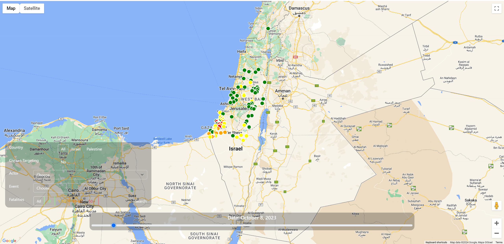
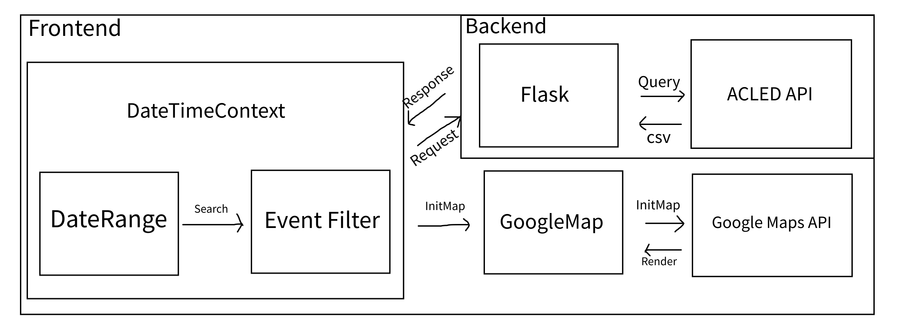

## About this project.
The project visualizes events in the Israel-Palestine conflict, utilizing interactive timelines. It aims to educate, inspire empathy, and advocate for sustainable solutions towards lasting peace.

Note: Please do not abuse the API KEY!

## Running Frontend

```bash
cd frontend
npm install
npm run dev
```

## Running Backend

```bash
cd backend
pip install -r requirements.txt
python -m flask --app app.py --debug run
```

## Project Structure


## Issues/Todos
* In filter section, the drop down menu for windows users are appearing white and hard to see (CSS)             ✅ Completed
* Implement live fetch for data using [ACLED API](https://apidocs.acleddata.com/) - Local in current stage      ✅ Completed
* Google maps refreshes when initMap() is called, make it to refresh the markers only.                          ✅ Completed
* Host the website (Maybe)
